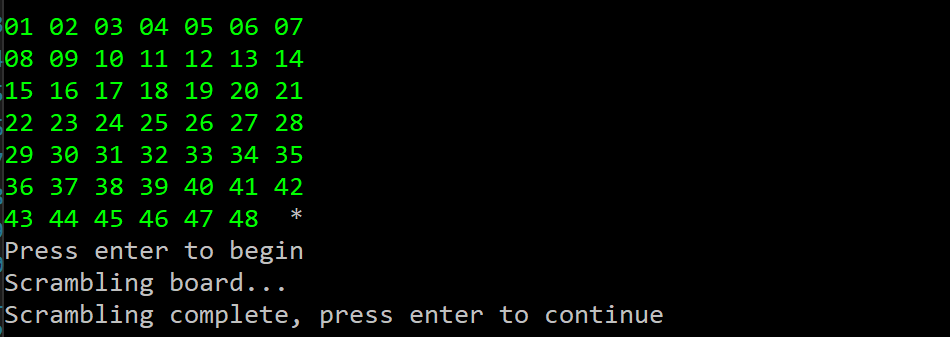

# slidingPuzzle.cpp

This was an assignment for college where I had to build an C++ program that generated an interactive sliding puzzle game based on user input. User input determined the number of rows and columns to generate on the board. Keeping this description minimal for my professors sake. 

